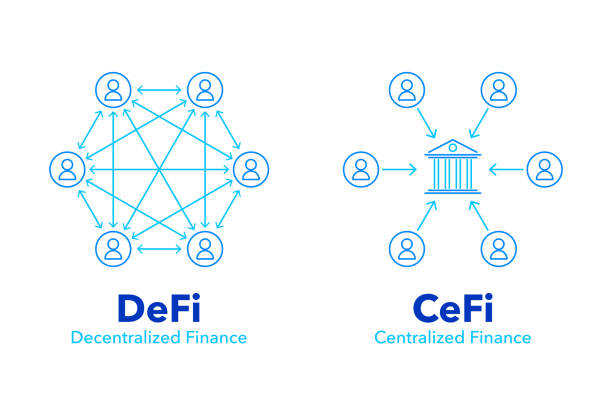
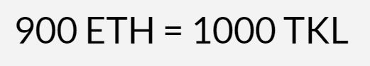
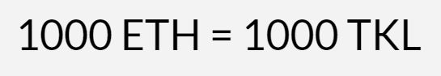
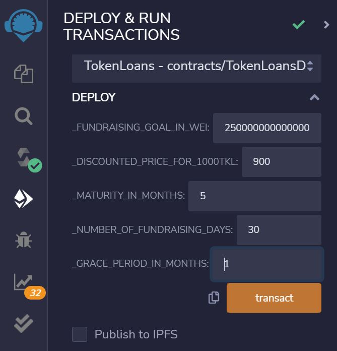
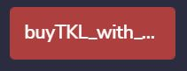
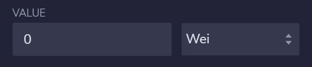
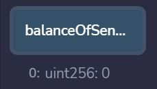
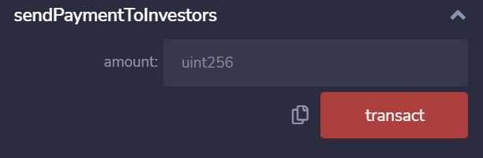
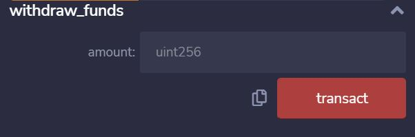

# TokenLoans

 

TokenLoans is a solidity contract that allows borrowers to fundraise Ether for a project. Investors can buy the tokens produced by the contract (ERC20 tokens) and they get paid back the principal and interest in equal monthly installments. The borrower selects the terms of the contract and investors decide whether to invests or not. 

The borrower sells its tokens at a discount and has to buy them back at parity. 

### Sell Tokens

In this example the borrower sells its tokens at a ratio of 900 to 1000 i.e. 900 Ether gives the investor 1000 tokens. 

 

### Buy Back the Tokens

The borrower has to buy back the tokens at parity i.e. 1 token gives back 1 Ether. The tokens produced by the contract have the same number of decimals (18) as Ether. 

 

The difference between the sell and buy price is the interest the investor makes. In this example the investors get an interest of 11.11%. The user has to pay in equal monthly installments. 

## What the Contract Cannot Do

* Force payment
* Schedule a payment 

Every solidity contract has these limitations. The Ethereum Virtual Machine does not offer a scheduling service and it cannot extract money from a private wallet. The contract, however, does provide two public variables that can be used to determine the health of the contract: percentage_paid_to_investors and contract_ended_successfully (this boolean turns true if the investors were paid within the timeframe stated by the borrower).

## How to Set Up the Contract

The contract has 5 constructors (as seen in Remix IDE):

 

1) Fundraising goal in wei: If the borrower wants 1 Ether they will have to put 1 followed by 18 zeros. 
2) Discounted price for 1000TKL: How much will an investor pay for 1000 of the borrower's tokens? This will define the exchange rate the borrower is selling its tokens for. 1000 means that the investors get zero interest. We suggest a number between 950 (interest of 5.26%) and 800 (interest of 25%).
3) Maturity in months: How many equal monthly payments does the borrower want to make?
4) Number of fundraising days: The borrower has to define a period for the fundraising. If the time ends and the goal hasn't been reached investors can pull their money out. 
5) Grace period in months: number of months before the borrower has to start making payments. 

The wallet that deploys the contract becomes the owner.

## Main Functions of the Contract

### Buy TKL with Wei

 

 

This function is public and can only be called before the fundraising ends. The fundraising ends when the fundraising goal is reached. In conjunction with the value interface in Remix the investor uses this button to buy tokens, there is a check in the function that stops the investor from buying more tokens than allowed by the fundraising goal. The investor can check the number of tokens bought by clicking the balanceOfSender button. 

 

### Make Monthly Payment

 

Only the owner can call this function after the fundraising ends. It takes the number of tokens sold and divides that between the number of monthly payments. It sends out a payment to investors proportional to the number of tokens they bought. It does not take into account possible early payments made by the borrower. 

### Send Payment to Investors

 

Only the owner can call this function after the fundraising ends. It divides up the amount entered in the interface among investors proportional to the tokens they bought. It is not possible for the borrower to pick one particular investor to receive the payment. The contract does not penalize early payment. 

### Withdraw Funds

 

Only the owner can call this function after the fundraising ends. The funds raised live in the contract, not in the owner's wallet. The owner has to use this function to withdraw funds.

